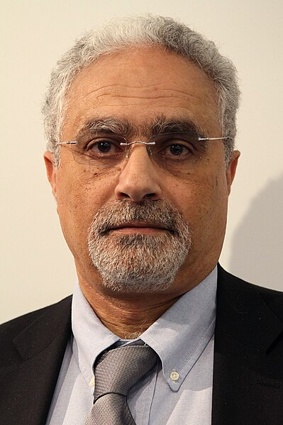

# Elgamal shifrlash algoritmi va kripto tahlili

 

**Tohir Elgamal 1955 yil 18 avgust misrlik-amerikalik kriptograf va texnologiya bo'yicha rahbar.**  

`p` -> katta tub son (1024 yoki 2048)  
`g` -> primitiv root (1 < g < p-1)  
`x` -> Alisaning maxfiy kaliti (1 < x < p)  
`b` -> Bobning maxfiy kaliti (1 < b < p)  
`y` -> ochiq kalit  
`M` -> shifrlabishi kerak bo'lgan xabar (1 < M < p)  
`c1` va `c2` -> Shifrlanga xabarlar  
y = $g^x$ mod p 

  

